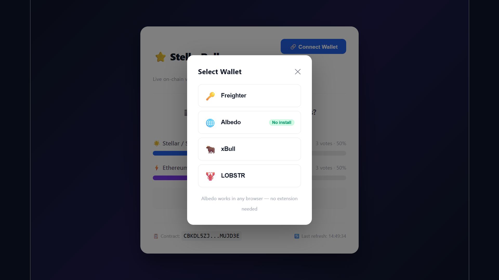
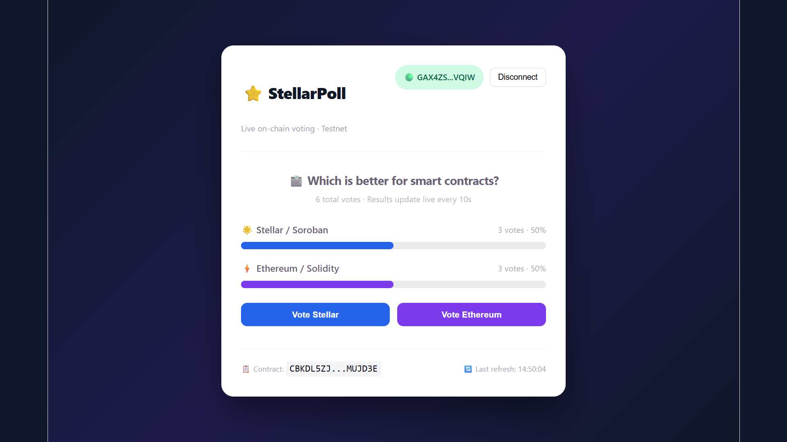
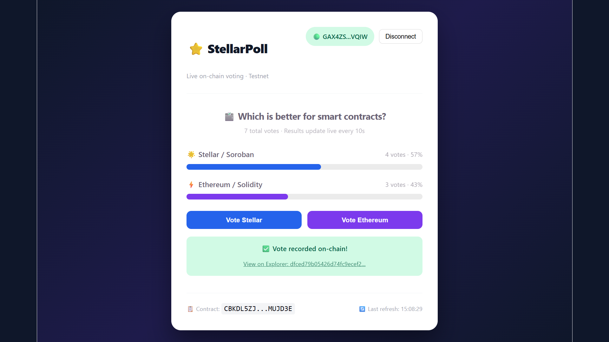

# ⭐ StellarPoll — Live On-Chain Voting DApp

A real-time voting DApp built on Stellar Soroban testnet.
Connect any Stellar wallet and vote on-chain — results update live every 10 seconds.

## Screenshots

### Wallet Selection (Multi-wallet support)


### Live Vote Results


### Transaction Success


## Features
- Multi-wallet support (Freighter, Albedo, xBull, LOBSTR)
- Soroban smart contract deployed on Stellar testnet
- Real-time vote results auto-refresh every 10s
- Transaction status tracking (pending → success/failed)
- 3 error types handled:
  - Wallet not found / not installed
  - User rejected transaction
  - Insufficient XLM balance

## Tech Stack
- React 18 + Vite 8
- Stellar SDK v13
- @creit.tech/stellar-wallets-kit v2.1.0
- Soroban smart contract (Rust)
- Stellar testnet

## Setup Instructions

### Prerequisites
- Node.js 18+
- Any Stellar wallet:
  - Freighter (freighter.app) — browser extension
  - Albedo (albedo.link) — no install needed
  - xBull (xbull.app) — browser extension
  - LOBSTR (lobstr.co) — browser extension
- Testnet XLM — get free from friendbot.stellar.org

### Run Locally
```bash
npm install
npm run dev
```
Open http://localhost:5173

### Get Testnet XLM
1. Connect your wallet
2. Visit https://friendbot.stellar.org
3. Enter your wallet address
4. Click Submit — receive 10,000 XLM instantly

## Deployed Contract
CBKDL5ZJATBCFCRL5TO6W76STH3GYULEDIRZIJG3BLEXTRGN4IMUJD3E

[View on Stellar Explorer](https://stellar.expert/explorer/testnet/contract/CBKDL5ZJATBCFCRL5TO6W76STH3GYULEDIRZIJG3BLEXTRGN4IMUJD3E)

## Transaction Hash (verified contract call)
dfced79b05426d74fc9ecef23ae62f9a9ee2541161796c2caa00a07bd16b21e4

[View on Stellar Explorer](https://stellar.expert/explorer/testnet/tx/dfced79b05426d74fc9ecef23ae62f9a9ee2541161796c2caa00a07bd16b21e4)

## Live Demo
https://stellar-live-poll-phi.vercel.app

## Level 2 Requirements
| Requirement | Status |
|---|---|
| 3 error types handled | Wallet not found, User rejected, Insufficient balance |
| Contract deployed on testnet | CBKDL5ZJATBCFCRL5TO6W76STH3GYULEDIRZIJG3BLEXTRGN4IMUJD3E |
| Contract called from frontend | vote() and get_votes() |
| Transaction status visible | pending → success/failed + explorer link |
| Minimum 2+ meaningful commits | Done |
| Multi-wallet support | Freighter, Albedo, xBull, LOBSTR |